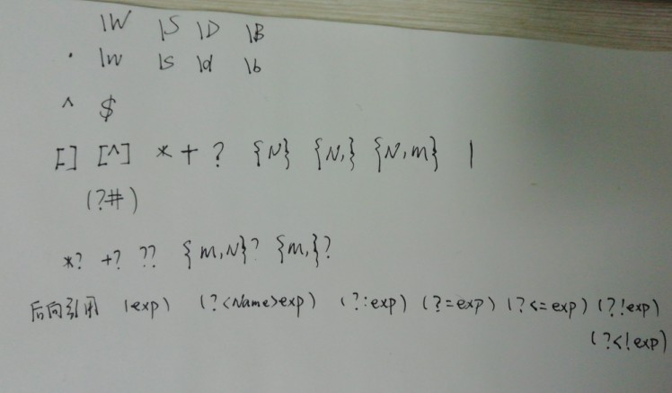

## 语言元素

- 字符串还有原始字符串表示法、字节字符串表示法、Unicode 字符串表示法，**而且可以书写成多行的形式（用三个单引号或三个双引号开头，三个单引号或三个双引号结尾）。**

## 函数和模块的使用

- 重构就是在不影响代码执行结果的前提下对代码的结构进行调整
- 函数的参数
  - Python 中，函数的参数可以有默认值
  - 传递参数的时候可以不按照设定的顺序传递
  - 不确定参数的时候可以使用可变参数
- Python 没有函数重载的概念，那么后面的定义会覆盖之前的定义
- py 中的模块化：
  - `from filename import function`
  - `import filename as objection`
  - 如果我们导入的模块除了定义函数之外还中有可以执行代码，那么 Python 解释器在导入这个模块时就会执行这些代码，适用于`import module`直接导入，解决方法使用:`if _name_ == '_main_'
- global 关键字可以指示函数中的变量成为全局变量
- 减少全局变量的使用，是降低代码耦合度的重要举措

## 字符串和常用数据结构

- 在`\`后面还可以跟一个八进制或者十六进制数来表示字符
- 不希望字符串中的`\`表示转义，我们可以通过在字符串的最前面加上字母`r`来加以说明
- 字符串操作，`+ * in not in`，以及切片
- 字符串前面加上 f 可以实现字符串输出的语法糖
- 可以通过切片来复制列表
- 通过反向切片可以获得倒转过来的列表拷贝
- 列表`[]`方法，和实例方法对传入的列表修改程度不同
- 通过生成式或者生成器可以生成数组或者对象
  - `yield`关键字将一个普通函数改造成生成器函数
- 元组`()`
  - 元组不可显式修改元素，只能元组整体替换
- 集合`{}`
  - set 构造函数
  - 创建集合的生成式语法
  - 集合的交集，并集，差集
- 字典
  - 字面量写法
  - 构造器函数
  - 生成式语法
  - 更新操作，显式更新和函数更新
  - 清空字典
## 面向对象编程
- 把一组数据结构和处理它们的方法组成对象，把相同行为的对象归纳为类，通过类的封装隐藏内部细节，通过继承实现类的特化和泛化，通过多态实现基于对象类型的动态分派。
- 构造器函数`_init_`以及对象方法的默认参数
- 对于对象中的私有方法和私有属性，可以通过前置两个下划线表明`__`
- 大多数Python程序员会遵循一种命名惯例就是让属性名以单下划线开头来表示属性是受保护的
## 面向对象进阶
- @property装饰器
  - 可以定义访问器和修改器
  - `@property`访问器方法
  - `@age.setter`修改器方法(age)
- _slots_黑魔法
  - 限定自定义类型的对象只能绑定某些属性，可以通过在类中定义\_\_slots\_\_变量来进行限定(原来的对象是动态的，可以自由的添加和解绑)
  ```python
  _slots_ = ('_name', '_age', '_gender')
  ```
- 静态方法和类方法
  - 静态方法使用@staticmethod标识
  - 类方法使用@classmethod标识，第一个参数默认为cls(代表当前类相关信息的对象)
- 类之间的关系
  - is-a关系也叫继承或泛化
  - has-a关系通常称之为关联
    - 如果是整体和部分的关联，那么我们称之为聚合关系
    - 整体进一步负责了部分的生命周期，那么这种就是最强的关联关系，我们称之为合成关系
  - use-a关系通常称之为依赖
- 继承和多态
```python

class Teacher(Person):

    def __init__(self, name, age, title):
        super().__init__(name, age)
        self._title = title

    @property
    def title(self):
        return self._title

    @title.setter
    def title(self, title):
        self._title = title

    def teach(self, course):
        print('%s%s正在讲%s.' % (self._name, self._title, course))
```
- 子类在继承了父类的方法后，可以对父类已有的方法给出新的实现版本，这个动作称之为方法重写（override）
- 当我们调用这个经过子类重写的方法时，不同的子类对象会表现出不同的行为，这个就是多态（poly-morphism）
- 顶级父类从Object那里继承来
- 抽象类就是不能够创建对象的类，这种类的存在就是专门为了让其他类去继承它
- 通过`abc`模块的`ABCMeta`元类和`abstractmethod`包装器来达到抽象类的效果
- 抽象方法使用abstractmethod(来自abc 模块)， 父类使用`metaclass=ABCMeta`标记实现抽象类的效果，抽象方法使用`pass`（干嘛用的？），但是再子类中要具体化抽象方法
## 图形用户界面和游戏开发
- 忽略
## 文件和异常
#### 读写文本文件
```PYTHON
f = open('致橡树.txt', 'r', encoding='utf-8')
    print(f.read())
    f.close()
with open('致橡树.txt', mode='r') as f:
        for line in f:
            print(line, end='')
            time.sleep(0.5)
    print()

    # 读取文件按行读取到列表中
    with open('致橡树.txt') as f:
        lines = f.readlines()
    print(lines)
    
```
- 错误情况：
  - `FileNotFoundError`无法打开指定文件
  - `LookupError`指定了未知编码
  - `UnicodeDecodeError`读取文件时解码错误
- 通过for逐行读取或者通过f.readlines()读取
- 读取二进制文件
  - 'rb'可以连着写
- 读取json文件
  - 使用Python中的json模块就可以将字典或列表以JSON格式保存到文件中
  - `dump` - 将Python对象按照JSON格式序列化到文件中
  - `dumps` - 将Python对象处理成JSON格式的字符串
  - `load` - 将文件中的JSON数据反序列化成对象
  - `loads` - 将字符串的内容反序列化成Python对象
  - 序列化的概念： 将数据结构或对象状态转换为可以存储或传输的形式
  - 反序列化： 一系列字节中提取数据结构的操作，就是反序列化（deserialization）
## 使用正则表达式
- python通过`re`模块来支持正则表达式操作

- 后向引用是啥？
- 字符串前面加`r`修饰符表示原始字符串，没有斜杠转义

## 进程和线程
- 进程就是操作系统中执行的程序，每个进程都有自己的地址空间，数据栈，以及其他用于跟踪进程执行的辅助数据
- 通过进程间通信机制来实现数据共享，具体实现方式有管道，信号，套接字，共享内存区等
- 一个进程可以拥有多个并发的执行线索，简单的说就是拥有多个可以获得cpu调度的执行单元
- Python实现并发编程的主要方式有三种：多进程，多线程，多进程 + 多线程
#### python中的多进程
- 由于Windows系统没有`fork()`调用，因此要实现跨平台的多进程编程，可以使用multiprocessing模块的`Process`类来创建子进程（用来执行异步操作，防止挂载时间过长）
- 
```python
def main():
    start = time()
    p1 = Process(target=download_task, args=('Python从入门到住院.pdf', ))
    # target代表传入的函数，表示进程启动后要之执行的代码。args表示传递给函数的参数
    p1.start()
    p2 = Process(target=download_task, args=('Peking Hot.avi', ))
    p2.start()
    p1.join()
    p2.join()
    # start方法表示启动进程，join表示等待进程执行结束
    end = time()
    print('总共耗费了%.2f秒.' % (end - start))

if __name__ == '__main__':
    main()
```
#### python中的多线程
- 引入threading模块实现多线程编程
- 多个线程共享同一个变量的时候，很可能产生不可控的结果从而导致程序失效而崩溃
- 如果一个资源同时被多个进程竞争使用，通常称为‘临界资源’
- 通过锁来保护`临界资源`，只有获得锁的线程才能访问`临界资源`，没有获得的线程只能阻塞起来
#### 多进程还是多线程
- 操作系统在切换进程或者线程时也是一样的，它需要先保存当前执行的现场环境（CPU寄存器状态、内存页等），然后，把新任务的执行环境准备好（恢复上次的寄存器状态，切换内存页等），才能开始执行
- 是否采用多任务的第二个考虑是任务的类型，可以把任务分为计算密集型和I/O密集型
- 对于I/O密集型任务，如果启动多任务，就可以减少I/O等待时间从而让CPU高效率的运转

#### 单线程+异步I/O
- 如果充分利用操作系统提供的异步I/O支持，就可以用单进程单线程模型来执行多任务，这种全新的模型称为事件驱动模型
- 在Python语言中，单线程+异步I/O的编程模型称为协程

## 网络编程入门
#### TCP./IP模型
- 网络协议的三要素是：语法、语义和时序
- 协议族就是一系列的协议及其构成的通信模型
- 自底向上依次是：网络接口层、网络层、传输层和应用层
- IP通常被翻译为网际协议，它服务于网络层，主要实现了寻址和路由的功能
- TCP全称是传输控制协议，是基于IP提供的寻址和路由服务建立起来的负责端到端的可靠的传输协议

#### 网络应用模型
- C/S模型和B/S模型
- 去中心化的网络应用模式（端对端p2p模式）

#### 基于HTTP协议的网络资源访问
- 超文本传输协议是一种用于分布式、协作式和超媒体信息系统的应用层协议
### 基于传输层协议的套接字编程
- 套接字就是一套用C语言写成的应用程序开发库，主要用于实现进程间通信和网络编程
#### 自动邮件，自动短信

## Linux操作系统
- 一个操作系统要负责任务调度，内存分配，处理外围设备I/O等操作
- 操作系统通常由内核（运行其他程序，管理像磁盘、打印机等硬件设备的核心程序）和系统程序（设备驱动、底层库、shell、服务程序等）两部分组成
- `cd`命令后面可以跟相对路径（以当前路径作为参照）或绝对路径（以`/`开头）来切换到指定的目录
#### yum
- `yum search`：搜索软件包，例如`yum search nginx`。
- `yum list installed`：列出已经安装的软件包，例如`yum list installed | grep zlib`。
- `yum install`：安装软件包，例如`yum install nginx`。
- `yum remove`：删除软件包，例如`yum remove nginx`。
- `yum update`：更新软件包，例如`yum update`可以更新所有软件包，而`yum update tar`只会更新tar。
- `yum check-update`：检查有哪些可以更新的软件包。
- `yum info`：显示软件包的相关信息，例如`yum info nginx`。
#### unix文件系统并不在乎文件扩展名，只是起到提示作用
