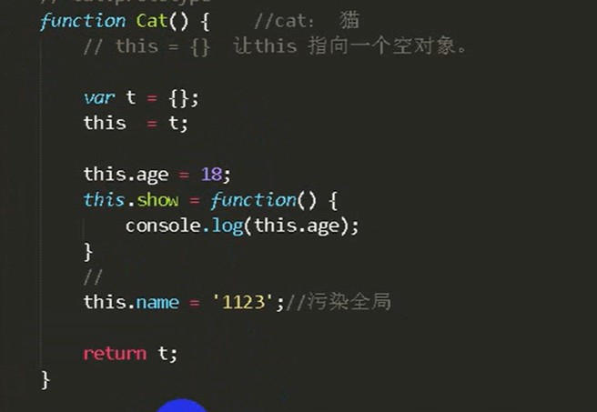

### day4-04express中的static-server静态资源服务

- ```javascript
  app.use(pathnam1, express.static(pathname2))
  ```
- pathname1表示请求的的文件前缀，相当于实际服务器路径的别名，为了更好的辨识
- pathname2表示服务器开放的资源路径

### day4-05在express中配置使用art-template模板引擎

- 如果想修改默认的render路径
  - `app.set('views', newname)`

### 如何处理post请求--在express中
-  如何获取post数据
  - express本身是没有获取post数据的api
  - 通过插件`body-parser`实现
  ```javascript
  app.use('/public/', express.static('./public/'))
  app.engine('html', require('express-art-template'))
  app.use(bodyParser.urlencoded({ extended: false }))
  app.use(bodyParser.json())
```

### day05

- 一般异步api都带有回调函数
- npm 5以后不用添加`--save`自动为`package.json`添加数据
- `package.lock.json`文件保存`node_modules`文件包依赖树，加快分析依赖；同样可以保证下载时版本的稳定性，防止版本自动更新带来的问题

### day06

- 函数作参数 == 回调函数
- 开启数据库 -- `mongod`(命令行中)
  - 连接数据库`mongo`
  - 断开连接数据库`exit`
  - 查看显示所有的数据库`show dbs`
  - 查看当前操作的数据库`db`
  - 切换到数据库（新建）`use 数据库名称`
  - 插入数据`db.students.insertOne({"name":"jack"})
  - 显示当前数据库的所有集合`show collections`
  - 查询指定对象的所有数据`db.students.find()
- mongodb中数据库（保存数组的对象），集合（数组），文档的概念（对象）

### day07

- node中两个特殊的模块
  - `__dirname`动态获取当前文件路径
  - `__filename`动态获取当前文件路径和文件名
- node中使用相对路径是不可靠的

- 当中间价调用next()含有参数(一般传入错误对象），则直接调用错误处理的中间件
```javascript
app.use(function(err, req, res, next){

})
app.get('/', function(req, res) {

})

app.use(functiion(req, res) {

})
```
- _proto_在所有的对象中都会有，prototype只是在函数对象中才会存在
